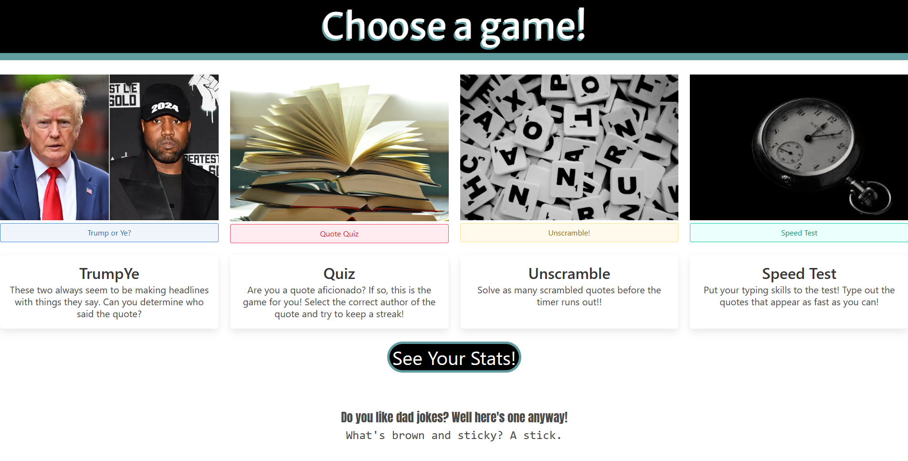

# World of Quotes

## Description

This website offers four distinct browser games relating to the topic of quotes. These games can help a user learn quote trivia, sharpen their intuition, or simply have some fun. 

Stats are stored across all games in local storage, and displayed in a stats page linked to on the home page. These include correct answers, wrong answers, times the click ran out, typing speed, etc.

## Installation

N/A

## Usage

From the home page, you are offered four brief descriptions of games with buttons to navigate to them, as well as a button that navigates to a stats page. Each game has a home button that will return you to this page. Each page has instructions for how to play that game.

For 'Trump or Ye?', each time you press Start you will be presented with a quote. In order to guess correctly, select the button with the face of who said the quote, either Trump or Kanye. A ten second timer will count down and you must answer before it expires.

For 'Quote Quiz', each time you press New Quote a quote will be displayed with four buttons naming authors. Select the correct author that corresponds with the given quote, before the ten second timer expires.

For 'Unscramble!', press enter to begin a new puzzle. On the left, a quote will be displayed with the words in a randomized  order. Your challenge is to type the body of the quote in the correct order. As you type words, they will be crossed out in the display to help you keep track of which words you have left to find a place for. Think fast - there is a 60 second timer. If you run out of time, you are given the correct answer to sate your curiosity.

For 'Speed Test', when you press Begin a quote will be displayed that you are to type as quickly as you can. Your progress is tracked by green highlighting, and a character will turn red if you mis-type it until you go back and enter it correctly. Your active quotes per minute and words per minute will be tracked, as will your maximum of each value this session.

On the stats page, you can read various locally stored information about your performance in each game, including all-time average typing speeds, and how many successes and failures you had at the various games.

To view the deployed product, visit: https://hornickjohn.github.io/quote-game/

## Credits

Tyler Vu - https://github.com/tvu328
Evan Chan - https://github.com/chanevan13
Rickie Flores - https://github.com/Raflores10
John Hornick - https://github.com/hornickjohn/

## License

N/A

## As-Deployed Screenshot

